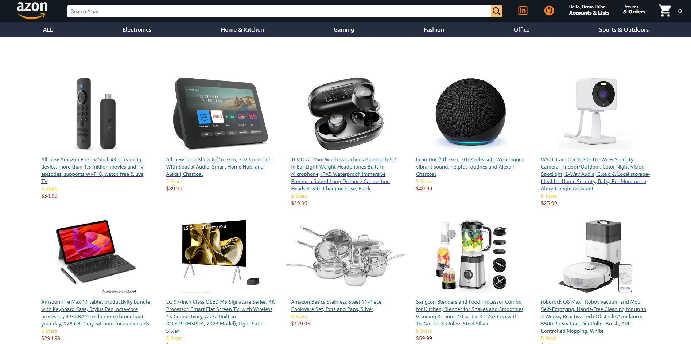

# Welcome To Azon

Check Out the [Live Site](https://azon.onrender.com/)

## Introduction

Azon has been crafted as a sophisticated emulation of a widely embraced and renowned e-commerce platform, drawing inspiration from the success of Amazon. This multinational technology and e-commerce giant offers an extensive range of products and services, spanning online retail, cloud computing, digital streaming, and cutting-edge smart devices. In line with the Amazon experience, Azon empowers users to effortlessly navigate a dynamic homepage teeming with a plethora of product options. Upon clicking, users are seamlessly guided through an immersive journey, allowing them to explore in-depth details about authentic products on their dedicated pages. For anyone accustomed to the convenience of shopping on Amazon, Azon provides a user-friendly interface that simplifies the process of browsing, adding items to the cart, and shopping with unparalleled ease and efficiency. The technologies implemented in this project include:

- Languages: Javascript, Ruby, HTML, and CSS
- Frontend: React-Redux
- Database: PostgreSQL
- Hosting: Render
- Asset Storage: AWS Simple Cloud Storage (S3)

# MVPs

()

## Nav Bar

Upon entering Azon, users will find themselves on the welcoming splash page adorned with the iconic navigation bar, providing them with easy access to explore the entire site at their convenience. From this starting point, users can seamlessly browse through the various offerings and navigate the platform effortlessly.

<!-- [Nav Bar](Placeholder) -->

```js
return (
  <div className="header">
    <div className="headerRow1">
      <Link to={"/"}>
        
      </Link>

      <div className="searchBar">
        <input type="text" className="inputSearch" placeholder="Search Azon" />

        
      </div>

      <div className="nav">
        <div className="optionIcon">
          <Link to={"https://github.com/Almoe099"}>
            
          </Link>
        </div>

        <div className="optionIcon">
          <Link to={"https://github.com/Almoe099"}>
            
          </Link>
        </div>

        <div className="option">
          <span className="optionLineOne">
            Hello, {!user ? "sign in" : user.name}
          </span>
          <div className="account-dropDown">
            <span className="optionLineTwo">Accounts & Lists</span>
            <div className="dropdown-content">
              <Link to={user ? "/" : "/login"}>
                <button
                  type="submit"
                  className="signin-button"
                  onClick={handleSubmit}
                >
                  {!user ? "Sign in" : "Sign out"}
                </button>
              </Link>
              <label className="new-customer-label">
                {!user ? "New customer?" : ""}
                <Link to={"/signup"}>{!user ? "Start here." : ""}</Link>
              </label>
            </div>
          </div>
        </div>

        <div className="option">
          <span className="optionLineOne">Returns</span>
          <span className="optionLineTwo">& Orders</span>
        </div>

        <div className="optionIcon">
          <Link to={"/cart"}>
            
          </Link>
          <span className="cartCount">{totalQuantity}</span>
        </div>
      </div>
    </div>

    <div className="headerRow2">
      <div className="categories">
        <NavLink to={"/"}>
          <div className="optionCategory">ALL</div>
        </NavLink>
        <NavLink to={"/?category=Electronics"}>
          <div className="optionCategory">Electronics</div>
        </NavLink>
        <NavLink to={"/?category=Home & Kitchen"}>
          <div className="optionCategory">Home & Kitchen</div>
        </NavLink>
        <NavLink to={"/?category=Gaming"}>
          <div className="optionCategory">Gaming</div>
        </NavLink>
        <NavLink to={"/?category=Fashion"}>
          <div className="optionCategory">Fashion</div>
        </NavLink>
        <NavLink to={"/?category=Office"}>
          <div className="optionCategory">Office</div>
        </NavLink>
        <NavLink to={"/?category=Sports & Outdoors"}>
          <div className="optionCategory">Sports & Outdoors</div>
        </NavLink>
      </div>
    </div>
  </div>
);
```

## Sign Up / Sign In

Users will have the flexibility to effortlessly sign up, log in, and log out of their Azon accounts, providing a seamless experience as they explore the platform. Once logged in, users can engage in a convenient shopping experience, adding desired products to their respective carts with ease.

### Sign Up


```js
return (
  <>
    <Link to={"/"}>
      
    </Link>
    <div className="signup-container">
      <h1>Create account</h1>
      <form onSubmit={handleSubmit}>
        {/* <ul> */}
        {errors.map((error) => (
          <li key={error} className="errors">
            {error}
          </li>
        ))}
        {/* </ul> */}

        <label>
          {" "}
          Your name
          <input
            type="text"
            value={name}
            onChange={(e) => setName(e.target.value)}
            required
            placeholder="First and last name"
          />
        </label>

        <label>
          {" "}
          Email
          <input
            type="text"
            value={email}
            onChange={(e) => setEmail(e.target.value)}
            required
          />
        </label>

        <label>
          {" "}
          Password
          <input
            type="password"
            value={password}
            onChange={(e) => setPassword(e.target.value)}
            required
            placeholder="At least 6 characters"
          />
        </label>

        <label>
          {" "}
          Re-enter password
          <input
            type="password"
            value={confirmPassword}
            onChange={(e) => setConfirmPassword(e.target.value)}
            required
          />
        </label>

        <button type="submit">Continue</button>

        <button type="submit" id="demo" onClick={demoLogin}>
          Demo Login
        </button>

        <p className="footerText">
          By creating an account, you agree to Azon&apos;s Conditions of Use and
          Privacy Notice.
        </p>
        <p className="footerLogin">
          Already have an account? <a href="/login">Sign in</a>{" "}
        </p>
      </form>
      <AuthFooter />
    </div>
  </>
);
```

### Sign In

()

```js
return (
  <div className="login">
    <Link to={"/"}>
      
    </Link>

    <div className="login-container">
      <h1>Sign in</h1>
      <form onSubmit={handleSubmit}>
        {errors.map((error) => (
          <li key={error} className="errors">
            {error}
          </li>
        ))}

        <label>
          Email
          <input
            type="text"
            value={email}
            onChange={(e) => setEmail(e.target.value)}
            required
            className="input"
          />
        </label>

        <label>
          Password
          <input
            type="password"
            value={password}
            onChange={(e) => setPassword(e.target.value)}
            required
          />
        </label>

        <button type="submit">Continue</button>

        <button type="submit" id="demo" onClick={demoLogin}>
          Demo Login
        </button>

        <p className="footerText">
          By continuing, you agree to Azon&apos;s Conditions of Use and Privacy
          Notice.
        </p>
      </form>
    </div>
    <div className="line">
      <p className="newAccount">New to Azon?</p>
      <Link to={"/signup"}>
        <button className="createButton" type="submit">
          Create your Azon account
        </button>
      </Link>
    </div>
    <AuthFooter />
  </div>
);
```

## Product Index

Users will be able to browse through all the products Azon has to offer and will be able to diffrienate between categories of thier interest

<!-- [Product Index](Placeholder) -->

```js
return (
  <div className="productsIndexPage">
    <div className="productsIndexDivider"></div>
    <div className="products-container">
      {products.map((product) => (
        <div key={product.id} className="product-card">
          <div className="card">
            
            <div className="card-content">
              <Link to={`/products/${product.id}`}>
                <p className="productName">{product.name}</p>
              </Link>
              <p className="productReview">5 Stars</p>
              <p className="productPrice">${product.price}</p>
            </div>
          </div>
        </div>
      ))}
    </div>
  </div>
);
```

## Product Show

Beyond the immersive product browsing experience on Azon, each product presents a link to its dedicated page. This page serves as a comprehensive resource, offering all the essential information you might need about the product of interest. From specifications to details, everything is conveniently available, allowing you to make informed decisions and seamlessly add items to your cart.


```js
return (
  <>
    <div className="fillerdiv"></div>
    <div className="productCardItem">
      <div className="leftColumn">
        <div className="productImageContainer">
          {
            
          }
        </div>
      </div>

      <div className="productDetailsContainer">
        <h1 className="productNameShow">{product.name}</h1>
        <div className="ratingContainer">
          <h3 className="productRatingShow">Rating</h3>
        </div>

        <div className="lineSeparator"></div>

        <h3 className="productPriceShow">${product.price}</h3>

        <div className="productTypeContainer">
          <div className="typeContainer">
            <p className="type">Category:</p>
          </div>
          <div className="productCategory">
            <p>{product.category}</p>
          </div>
        </div>
        <div className="productTypeContainer">
          <div className="typeContainer">
            <p className="type">Brand:</p>
          </div>
          <div className="productBrand">
            <p>{product.brand}</p>
          </div>
        </div>
        <div className="productTypeContainer">
          <div className="typeContainer">
            <p className="type">Dimensions:</p>
          </div>
          <div className="productDimensions">
            <p>{product.dimensions}</p>
          </div>
        </div>
        <div className="productTypeContainer">
          <div className="typeContainer">
            <p className="type">Weight:</p>
          </div>
          <div className="productWeight">
            <p>{product.weight}</p>
          </div>
        </div>

        <div className="lineSeparator"></div>

        <label className="about">About this item</label>
        <ul className="productDescriptionContainer">
          {product.description.split(".").map((line, index) => {
            return (
              <li className="productDescription" key={index}>
                {line}
              </li>
            );
          })}
        </ul>
      </div>
      <div className="cartContainer">
        <h3 className="productPriceShow">${product.price}</h3>
        <span className="freeR">Free Returns</span>
        <span className="delivery">
          <DeliveryComponent />
        </span>
        <h4 className="Availabilty">In Stock</h4>

        <form>
          <div className="quantityContainer">
            <span className="quantity">Quantity:</span>
            <select
              className="productQuantity"
              name="productQuantity"
              value={quantity}
              onChange={handleQuantity}
            >
              {Array.from({ length: 10 }, (_, index) => (
                <option key={index + 1} value={index + 1}>
                  {index + 1}
                </option>
              ))}
            </select>
          </div>
          <button className="cartButton" onClick={handleCart}>
            Add to Cart
          </button>
          <button className="buyButton" type="submit">
            Buy Now
          </button>
        </form>

        <div className="cartFooterContainer">
          <div className="firstFooter">
            <span className="start">Ships from</span>
          </div>
          <div className="SecondFooter">
            <span className="end">Azon.com</span>
          </div>
        </div>

        <div className="cartFooterContainer">
          <div className="firstFooter">
            <span className="start">Sold by</span>
          </div>
          <div className="SecondFooter">
            <span className="end">Azon.com</span>
          </div>
        </div>

        <div className="cartFooterContainer">
          <div className="firstFooter1">
            <span className="start">Returns</span>
          </div>
          <div className="SecondFooter">
            <span className="returns">
              Eligible for Return, Refund or Replacement within 30 days of
              receipt
            </span>
          </div>
        </div>

        <div className="cartFooterContainer">
          <div className="firstFooter">
            <span className="start">Payment</span>
          </div>
          <div className="SecondFooter">
            <span className="returns">Secure transaction</span>
          </div>
        </div>
      </div>
    </div>
    <div className="productFooter">
      <Footer />
    </div>
  </>
);
```

## Sorted By Categories

Empower users to effortlessly browse curated categories, simplifying their search and ensuring a seamless shopping experience to find exactly what they're looking for.


```js
<div className="categories">
  <NavLink to={"/"}>
    <div className="optionCategory">ALL</div>
  </NavLink>
  <NavLink to={"/?category=Electronics"}>
    <div className="optionCategory">Electronics</div>
  </NavLink>
  <NavLink to={"/?category=Home & Kitchen"}>
    <div className="optionCategory">Home & Kitchen</div>
  </NavLink>
  <NavLink to={"/?category=Gaming"}>
    <div className="optionCategory">Gaming</div>
  </NavLink>
  <NavLink to={"/?category=Fashion"}>
    <div className="optionCategory">Fashion</div>
  </NavLink>
  <NavLink to={"/?category=Office"}>
    <div className="optionCategory">Office</div>
  </NavLink>
  <NavLink to={"/?category=Sports & Outdoors"}>
    <div className="optionCategory">Sports & Outdoors</div>
  </NavLink>
</div>
```

## Real Time Shipping

Azon not only provides you with the convenience of making a purchase but also keeps you well-informed about the delivery details of your selected products.

```js
const DeliveryComponent = () => {
  const [deliveryRange, setDeliveryRange] = useState("");

  useEffect(() => {
    const currentDate = new Date();

    const deliveryDate = new Date(currentDate);
    deliveryDate.setDate(currentDate.getDate() + 5);

    const endDeliveryDate = new Date(currentDate);
    endDeliveryDate.setDate(currentDate.getDate() + 7);

    const deliveryDateStr = deliveryDate.toLocaleDateString("en-US", {
      month: "long",
      day: "numeric",
    });
    const endDeliveryDateStr = endDeliveryDate.toLocaleDateString("en-US", {
      month: "long",
      day: "numeric",
    });

    setDeliveryRange(`${deliveryDateStr} - ${endDeliveryDateStr}`);
  }, []);

  return (
    <div>
      <div className="delivery">
        <span className="freeD">Free Delivery</span>
        {deliveryRange && <>{deliveryRange}</>}.
      </div>
    </div>
  );
};
```

## Cart

Unlocking the essence of convenience, Azon's cart feature is the enchanting force behind it all. Within your Azon cart, users can seamlessly add products, adjust quantities, and effortlessly remove items at their discretion. When the time comes, users can proceed to checkout, and even upon logging out, Azon ensures that items remaining in the cart are diligently saved for future contemplation.


```js
return (
  <>
    <div className="cartIndexContainer">
      <div className="CartPage">
        {carts.length === 0 ? (
          <div className="cartImageContainer">
            
          </div>
        ) : (
          <p></p>
        )}

        {carts.length === 0 ? (
          <div className="emptyCartContainer">
            <div className="emptyCart">
              <h1 className="cartEmptyH1">Your Azon Cart is empty</h1>

              <NavLink to="/products">
                <p className="cartEmptyP">
                  Check your Saved for later items below or continue shopping.
                </p>
              </NavLink>
            </div>

            {!user ? (
              <div className="cartButtons">
                <NavLink to="/login">
                  <button className="emptyCartBtnSignIn">
                    Sign in to your account
                  </button>
                </NavLink>
                <NavLink to="/signup">
                  <button className="emptyCartBtnSignUp">Sign up now</button>
                </NavLink>
              </div>
            ) : (
              <p></p>
            )}
          </div>
        ) : (
          <ul className="CartIndexUl">
            <h1>Your Azon Cart</h1>
            {carts.map((cart, index) => (
              <li className="cartIndexLi" key={`${cart.id}_${index}`}>
                <CartShow cart={cart} />
              </li>
            ))}
          </ul>
        )}
      </div>

      {quantity && (
        <div className="checkoutContainerBox">
          <span className="freeShipping">
            Your order qualifies for FREE Shipping.
          </span>

          <p className="totalPrice">
            Subtotal ({quantity} {more ? "Items" : "Item"}): ${total}.00
          </p>

          <label className="giftContainer" htmlFor="radio">
            <input
              className="giftRadio"
              type="checkbox"
              value="This order contains a gift"
            />
            <span className="giftSpan">This order contains a gift</span>
          </label>

          {quantity && (
            <NavLink to="/checkout">
              <button type="submit" className="checkoutButton">
                Checkout
              </button>
            </NavLink>
          )}
        </div>
      )}
    </div>
    <div className="cartFooter">
      <Footer />
    </div>
  </>
);
```

## CC Licensing:

- <a href="https://www.textstudio.com/">Font generator</a>

- <a href="https://www.flaticon.com/free-icons/shopping-cart" title="shopping cart icons">Shopping cart icons created by HideMaru - Flaticon</a>

- <a href="https://www.textstudio.com/">Font generator</a>

- <a target="_blank" href="https://icons8.com/icon/85180/shopping-cart">Cart</a> icon by <a target="_blank" href="https://icons8.com">Icons8</a>

- <a target="_blank" href="https://icons8.com/icon/64154/linkedin">LinkedIn</a> icon by <a target="_blank" href="https://icons8.com">Icons8</a>

- <a target="_blank" href="https://icons8.com/icon/118557/github">GitHub</a> icon by <a target="_blank" href="https://icons8.com">Icons8</a>

- <a target="_blank" href="https://icons8.com/icon/NTCUeTIie8CC/linkedin">LinkedIn</a> icon by <a target="_blank" href="https://icons8.com">Icons8</a>

- <a target="_blank" href="https://icons8.com/icon/E2KVOMc77Geo/github">GitHub</a> icon by <a target="_blank" href="https://icons8.com">Icons8</a>

## Thanks

Despite Azon being developed within a remarkably brief timeframe of just 14 days, the process was filled with enjoyment. I trust that you'll relish future iterations of this Amazon-inspired clone.
